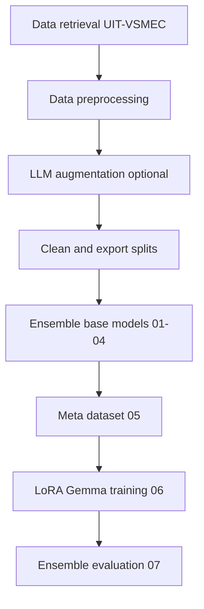

# Ensemble Learning for Vietnamese Emotion Recognition

This repository contains research code for Vietnamese fine-grained emotion recognition, with **ensemble learning** as the main direction.

The core pipeline is a **stacked ensemble** in [`tm_research/ensemble`](tm_research/ensemble), where multiple base classifiers are combined and refined by a Gemma meta-model. A parallel **VSFC sentiment** pipeline lives under [`tm_research/VSFC_ensemble`](tm_research/VSFC_ensemble). Supporting work includes LLM data augmentation and preprocessing notebooks.

## Project Focus

- **Main topic**: Ensemble learning for Vietnamese emotion classification (UIT-VSMEC) and sentiment classification (UIT-VSFC).
- **Primary objective**: Improve macro-level and minority-class performance through model combination and meta-learning.
- **Supporting work**: LLM-based data augmentation, data preprocessing, synthetic-data QA.

## Dataset

### UIT-VSMEC (emotion)

- **Corpus**: [UIT-VSMEC](https://nlp.uit.edu.vn/datasets) (Vietnamese Social Media Emotion Corpus).
- **Labels**: `Enjoyment`, `Sadness`, `Fear`, `Anger`, `Disgust`, `Surprise`, `Other`.
- **Working format**: `text` (Vietnamese sentence) and `label` (emotion category).

### UIT-VSFC (sentiment)

- **Corpus**: [UIT-VSFC](https://huggingface.co/datasets/uitnlp/vietnamese_students_feedback) (Vietnamese Students' Feedback Corpus).
- **Labels**: `negative`, `neutral`, `positive`.

---

## Environment Setup

From the repository root:

```bash
python -m venv .venv
source .venv/bin/activate   # Windows: .venv\Scripts\activate
pip install -r requirements.txt
```

Create `tm_research/.env` for API-backed stages:

| Variable | Used by | Notes |
| --- | --- | --- |
| `GOOGLE_API_KEY` | [`augmentation/Data_Augmentation_LLM.ipynb`](tm_research/augmentation/Data_Augmentation_LLM.ipynb) | Gemini via LangChain |
| `HF_TOKEN` | [`ensemble/06_train_meta_lora_gemma.ipynb`](tm_research/ensemble/06_train_meta_lora_gemma.ipynb) | Accept [Gemma-2 license](https://huggingface.co/google/gemma-2-9b-it) on HuggingFace |

**Hardware**

- **BERT base models (ensemble 01–04):** CUDA GPU recommended.
- **Gemma LoRA meta-model (ensemble 06):** ~24 GB VRAM (A100 / A6000 class).
- **Google Colab:** the first setup cell in ensemble notebooks calls [`colab_setup.py`](tm_research/ensemble/colab_setup.py) to mount Drive and route HuggingFace cache to `/content/ensemble_tmp`.

**How to run notebooks:** open in Jupyter or VS Code, select the `.venv` kernel, enable a GPU runtime (Colab or local CUDA), and run cells top-to-bottom. Processed CSVs live under `tm_research/data/processed/` and are **not committed** to git.

---

## Minimum Path to Reproduce the VSMEC Ensemble

If you only need the headline stacked-ensemble result:

1. Obtain UIT-VSMEC and build `train_1500_final.csv`, `val_final.csv`, `test_final.csv` under `tm_research/data/processed/` (see Stage 1–2 below).
2. *(Optional)* Run LLM augmentation and preprocessing for augmented training data (Stage 3).
3. Run ensemble notebooks [`01`](tm_research/ensemble/01_base_phobert_oof.ipynb) → [`07`](tm_research/ensemble/07_evaluate_ensemble.ipynb) sequentially on a GPU machine.
4. Inspect [`tm_research/ensemble/artifacts/metrics/ensemble_summary.json`](tm_research/ensemble/artifacts/metrics/ensemble_summary.json).

Hyperparameters and artifact layout: [`tm_research/ensemble/WORKFLOW.md`](tm_research/ensemble/WORKFLOW.md).

---

## VSFC Sentiment Ensemble

1. Run [`preprocessing/VSFC_DataPreprocessing.ipynb`](tm_research/preprocessing/VSFC_DataPreprocessing.ipynb) → `data/processed/vsfc/vsfc_{train,val,test}_final.csv`.
2. Run [`VSFC_ensemble/01`](tm_research/VSFC_ensemble/01_base_phobert_oof.ipynb) → [`07`](tm_research/VSFC_ensemble/07_evaluate_ensemble.ipynb) on a GPU machine.
3. Optional demo: [`08_demo_ensemble_predict.ipynb`](tm_research/VSFC_ensemble/08_demo_ensemble_predict.ipynb).

Details: [`tm_research/VSFC_ensemble/WORKFLOW.md`](tm_research/VSFC_ensemble/WORKFLOW.md).

---

## End-to-End Pipeline (VSMEC)



**Canonical ensemble inputs** ([`utils_io.py`](tm_research/ensemble/utils_io.py)):

- `tm_research/data/processed/train_1500_final.csv`
- `tm_research/data/processed/val_final.csv`
- `tm_research/data/processed/test_final.csv`

Column names are normalized automatically: text from `Sentence_clean` / `Sentence` / `text`; label from `Emotion` / `label`.

---

### Stage 1 — Data Retrieval

**Sources**

- Official: [UIT NLP datasets](https://nlp.uit.edu.vn/datasets)
- Mirror: [HuggingFace `tridm/UIT-VSMEC`](https://huggingface.co/datasets/tridm/UIT-VSMEC)

**Expected local files** (8:1:1 split used across notebooks). Place under repo `data/`:

- `train_nor_811.xlsx`
- `valid_nor_811.xlsx`
- `test_nor_811.xlsx`

From the raw splits, preprocessing notebooks produce CSVs under `tm_research/data/processed/` (created at runtime, not in git).

---

### Stage 2 — Data Preprocessing

**Notebooks:**

| Corpus | Notebook |
| --- | --- |
| UIT-VSMEC | [`preprocessing/DataPreprocessing.ipynb`](tm_research/preprocessing/DataPreprocessing.ipynb) |
| UIT-VSFC | [`preprocessing/VSFC_DataPreprocessing.ipynb`](tm_research/preprocessing/VSFC_DataPreprocessing.ipynb) |

**Shared logic:** [`tm_research/text_preprocess.py`](tm_research/text_preprocess.py) (`preprocess_vietnamese_text`)

**What it does:** emoji/emoticon/abbreviation normalization, URL/HTML stripping, deduplication, shuffle (seed 42). Stopwords are intentionally kept for BERT.

**Typical VSMEC I/O** (see [`preprocessing/DataPreprocessing.md`](tm_research/preprocessing/DataPreprocessing.md)):

| | Path |
| --- | --- |
| Input | `data/processed/train_1500_para_processed.csv` |
| Output | `data/processed/train_1500_para_final.csv` |

**Intermediate splits** used by augmentation and ensemble notebooks: `train_org_processed.csv`, `val_processed.csv`, `test_processed.csv`, and `*_final.csv`.

---

### Stage 3 — LLM Data Augmentation *(optional)*

**Notebook:** [`augmentation/Data_Augmentation_LLM.ipynb`](tm_research/augmentation/Data_Augmentation_LLM.ipynb)

**Requires:** `GOOGLE_API_KEY` in `tm_research/.env`

| | Path |
| --- | --- |
| Input | `data/processed/train_org_processed.csv` |
| Output | `train_balanced_optimized.csv` — original + synthetic |
| Output | `train_1500_gen_eval.csv` — with provenance columns |
| Output | `train_1500_gen_clean.csv` — training-ready (3 columns) |

**Optional QA:**

- [`augmentation/Synthetic_Data_Fidelity_Eval.ipynb`](tm_research/augmentation/Synthetic_Data_Fidelity_Eval.ipynb) — statistical fidelity
- [`augmentation/Generated_data_eval.ipynb`](tm_research/augmentation/Generated_data_eval.ipynb) — lexical diversity (Distinct-n, Self-BLEU)

**Details:** [`augmentation/Data_Augmentation_LLM.md`](tm_research/augmentation/Data_Augmentation_LLM.md)

---

### Stage 4 — Stacked Ensemble + LLM Meta-Model (VSMEC)

Run notebooks **in order** under [`tm_research/ensemble/`](tm_research/ensemble/):

| Step | Notebook | Produces |
| --- | --- | --- |
| 01 | [`01_base_phobert_oof.ipynb`](tm_research/ensemble/01_base_phobert_oof.ipynb) | `artifacts/probs/phobert_{oof,val,test}.npy` |
| 02 | [`02_base_cafebert_oof.ipynb`](tm_research/ensemble/02_base_cafebert_oof.ipynb) | `artifacts/probs/cafebert_*.npy` |
| 03 | [`03_base_vibert_oof.ipynb`](tm_research/ensemble/03_base_vibert_oof.ipynb) | `artifacts/probs/vibert_*.npy` |
| 04 | [`04_base_sklearn_oof.ipynb`](tm_research/ensemble/04_base_sklearn_oof.ipynb) | `artifacts/probs/logreg_*.npy`, `svc_*.npy` |
| 05 | [`05_weights_and_meta_dataset.ipynb`](tm_research/ensemble/05_weights_and_meta_dataset.ipynb) | `artifacts/weights.json`, `artifacts/meta_jsonl/{train,val,test}.jsonl` |
| 06 | [`06_train_meta_lora_gemma.ipynb`](tm_research/ensemble/06_train_meta_lora_gemma.ipynb) | `artifacts/lora_adapter/` (QLoRA on `google/gemma-2-9b-it`) |
| 07 | [`07_evaluate_ensemble.ipynb`](tm_research/ensemble/07_evaluate_ensemble.ipynb) | `artifacts/metrics/ensemble_summary.json` |
| 08 *(demo)* | [`08_demo_ensemble_predict.ipynb`](tm_research/ensemble/08_demo_ensemble_predict.ipynb) | batch inference demo |

**Deep reference:** [`tm_research/ensemble/WORKFLOW.md`](tm_research/ensemble/WORKFLOW.md)

**Artifacts root:** `tm_research/ensemble/artifacts/` (override with env var `TM_ENSEMBLE_ARTIFACTS_DIR`).

High-level flow:

1. Train heterogeneous base models and generate out-of-fold (OOF) probabilities.
2. Build a stacking/meta dataset from model probabilities and weighted aggregates.
3. Fine-tune a meta-model (Gemma + LoRA/QLoRA) on structured ensemble signals.
4. Evaluate ensemble systems against single-model and weighted-average baselines.

---

## Experimental Results (thesis)

Key reported results from the thesis write-up:

### Minority-class F1 (Fear, Anger, Surprise) with CafeBERT and Gemini-2.5-Flash augmentation

| Setting | Fear | Anger | Surprise |
| --- | --- | --- | --- |
| Original | 67% | 38% | 60% |
| Paraphrased | 67% | 42% | 61% |
| Generated | 68% | 46% | 61% |

### CafeBERT robustness (original vs. augmented training)

| Training data | Accuracy | Weighted F1 |
| --- | --- | --- |
| Original | 0.6344 | 0.628 |
| Paraphrased augmented | 0.6676 | 0.6682 |
| Generated augmented | 0.6703 | 0.671 |

### Ensemble vs. baselines (UIT-VSMEC)

| Method | Accuracy | Weighted F1 |
| --- | --- | --- |
| **Stacked ensemble + Gemma meta-model (OUR WORK)** | **0.7023** | **0.7022** |
| CafeBERT + augmented data | 0.6676 | 0.6682 |
| Gemma zero-shot prompting | 0.6864 | 0.6809 |
| MLR + preprocessing + key-clause extraction | 0.6436 | 0.6440 |

---

## Project Structure

```text
tm_research/
  preprocessing/               # VSMEC + VSFC cleaning notebooks
  augmentation/                # LLM augmentation + QA eval
  ensemble/                    # VSMEC stacked ensemble (01–08) + artifacts/
  VSFC_ensemble/               # VSFC stacked ensemble (01–08) + artifacts/
  text_preprocess.py
  eval/vsfc_labels.py
  data/processed/              # runtime CSV splits (not in git)
data/                          # raw UIT-VSMEC Excel splits (not in git)
Confusion_matrix/              # ensemble eval outputs
requirements.txt
README.md
```

---

## Notes

- Ensemble learning is the canonical direction for this project.
- Further reading: [`augmentation/Data_Augmentation_LLM.md`](tm_research/augmentation/Data_Augmentation_LLM.md), [`preprocessing/DataPreprocessing.md`](tm_research/preprocessing/DataPreprocessing.md), [`ensemble/WORKFLOW.md`](tm_research/ensemble/WORKFLOW.md), [`VSFC_ensemble/WORKFLOW.md`](tm_research/VSFC_ensemble/WORKFLOW.md).
